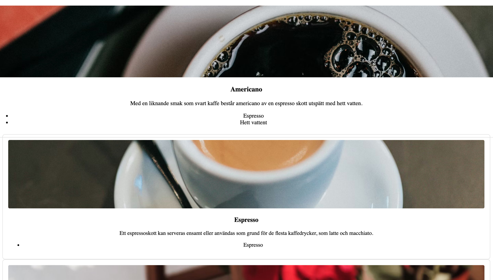
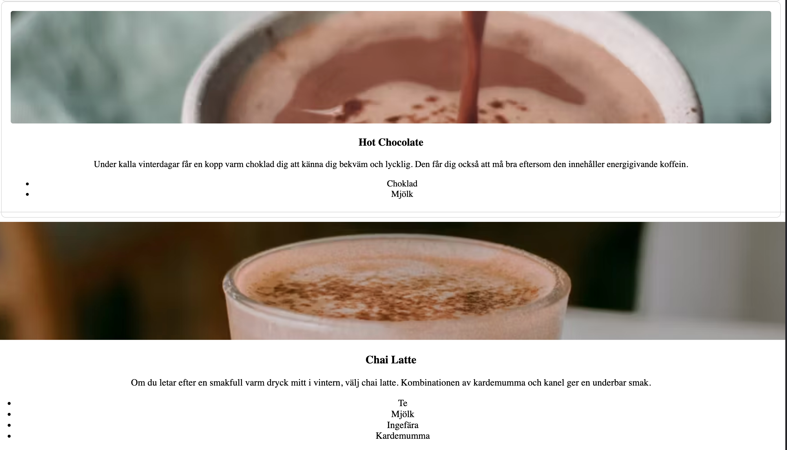

# Coffee Menu App ☕


A simple Angular 18+ application that displays a list of hot coffee drinks from a public API.

---

## Features
- Fetches hot coffee drinks from [SampleAPIs Coffee API](https://api.sampleapis.com/coffee/hot)
- Displays **title, description, ingredients, and image**
- Loading and error handling
- Responsive card layout for all screen sizes
- Clean and modern UI design

---

## Tech Stack
- Angular 18+
- TypeScript
- CSS

---

## Screenshots

> Replace these with actual screenshots from your app

  
  

---

## How to Run Locally

1. Clone the repository:

```bash
git clone https://github.com/Akshat23232/coffee-menu-app.git
